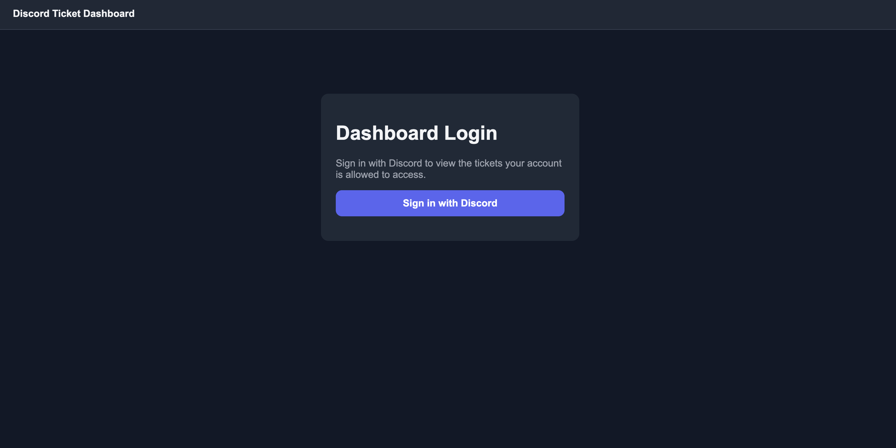
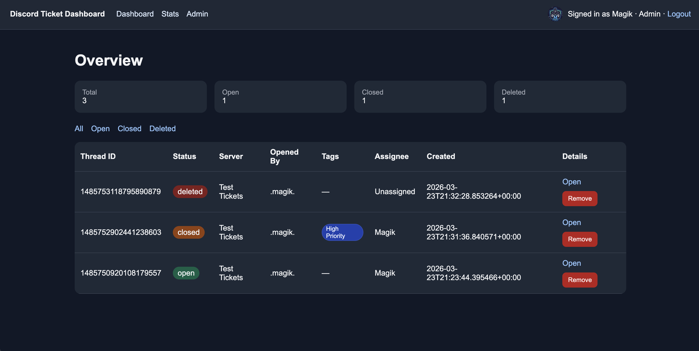
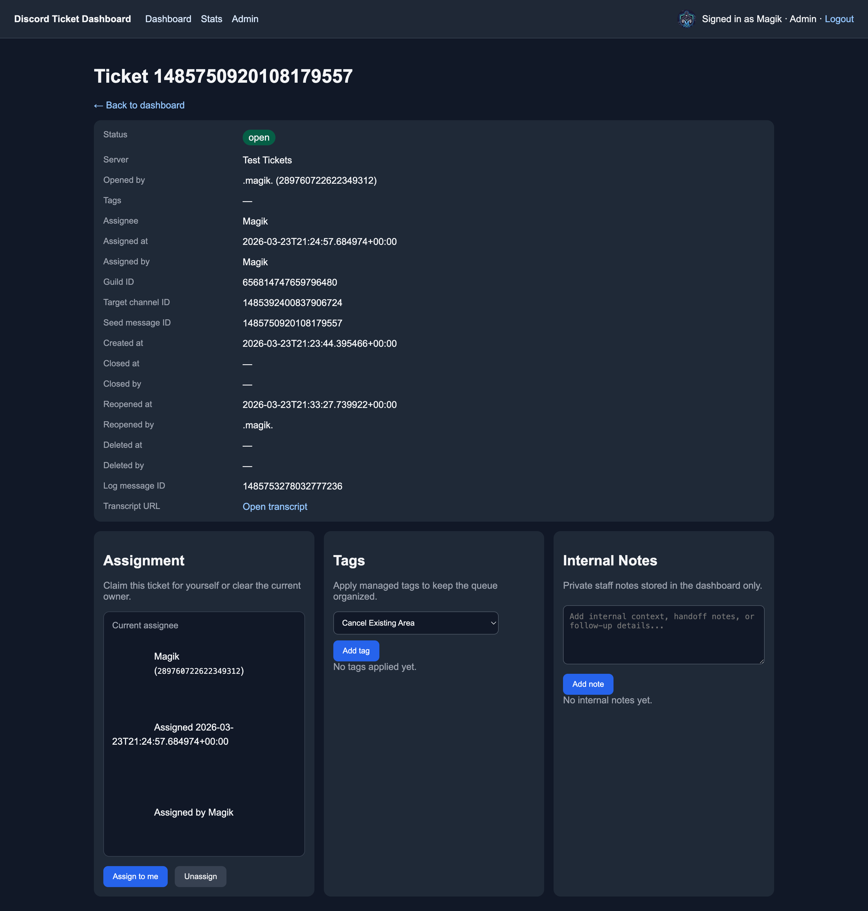
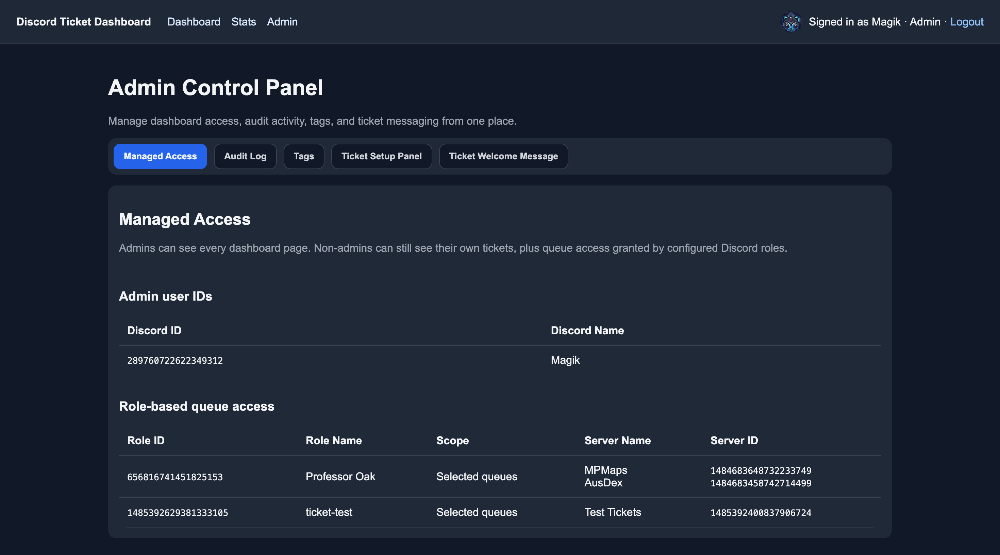
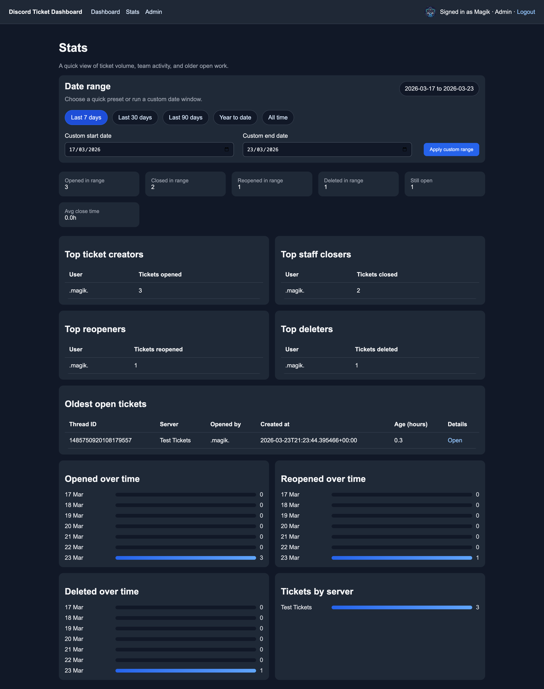
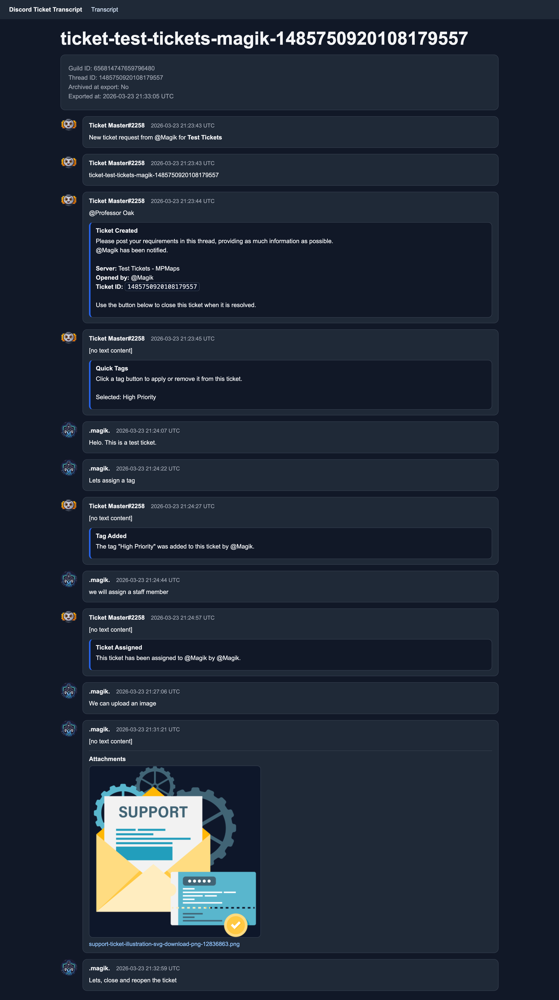

# Dashboard Guide

## Overview

The dashboard provides:

- ticket overview
- ticket detail pages
- transcript browsing
- stats
- admin controls
- Discord OAuth login





## Access model

Dashboard viewers can see:

- their own tickets by default
- additional queues granted by configured Discord roles
- all pages if their Discord user ID is listed in `admin_user_ids`

Admin pages use the configured guild and cached bot-synced role/member directory values for Managed Access summaries.

## What staff-capable viewers can do

On ticket detail pages, staff-capable viewers can:

- assign and unassign tickets
- add, edit, and delete internal notes
- add and remove managed tags

Dashboard actions that affect the live thread are queued in the database and then posted by the bot into Discord.

That includes:

- assignment and unassignment notices
- assigned-user thread membership sync
- tag add and remove notices

The in-thread Quick Tags buttons can also hide specific managed tags using `[tickets] hidden_thread_tag_names` in `config.ini`, while still leaving those tags available in slash commands and the dashboard.



## Admin Control Panel

The Admin page is organized into tabs:

- Managed Access
- Audit Log
- Tags
- Ticket Setup Panel
- Ticket Welcome Message
- Welcome Tags

Admins can:

- review admin user IDs and role-based queue access
- review recent dashboard audit events
- create, edit, and delete managed tags
- update the public ticket panel message
- update the ticket welcome message sent into new threads
- update the quick-tag selector message shown in new ticket threads



## Stats

The stats page gives a higher-level operational view of ticket activity across the tracked queue.



## Placeholders

Ticket panel placeholders:

- `{guild_name}`
- `{panel_channel_mention}`

Thread welcome placeholders:

- `{guild_name}`
- `{server_label}`
- `{user_mention}`
- `{user_name}`
- `{thread_id}`

You can also hardcode Discord mentions:

- user mention: `<@1234567890>`
- role mention: `<@&1234567890>`
- channel mention: `<#1234567890>`

Example thread message:

```text
**Server:** {server_label}
**Opened by:** {user_mention}
Moderator ping: <@&1234567890>
**Ticket ID:** `{thread_id}`
```

Example panel description:

```text
Welcome to {guild_name}.
Press **Create Ticket** below to open a support request in {panel_channel_mention}.
```

## Transcripts

HTML transcripts use the same visual language as the dashboard and include ticket metadata plus the rendered conversation history.



## Notes

- Closed ticket log messages can link back to the dashboard using `[dashboard] base_url`
- If HTML transcripts are disabled, ticket detail pages fall back to stored transcript message URLs when available
- The dashboard includes a friendly `403` page for denied admin access instead of a raw framework error
